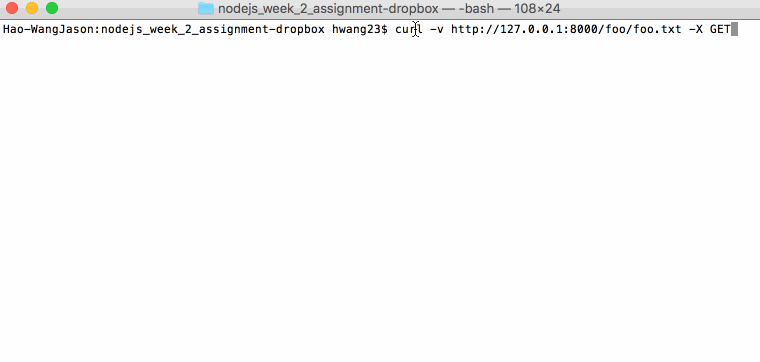

# nodejs-week2-assignment

Time spent: [6]
Completed:
* [x] Required: Walkthrough Gif embedded in README 
* [x] Required: README `Time spent:` includes the number of hours spent on the assignment
* [x] Required: Client can make GET requests to get file or directory contents
* [x] Required: Client can download a directory as an archive
* [x] Required: Client can make HEAD request to get just the GET headers 
* [x] Required: Client can make PUT requests to create new directories and files with content
* [x] Required: Client can make POST requests to update the contents of a file
* [x] Required: Client can make DELETE requests to delete files and folders
* [x] Required: Server will serve from `--dir` or cwd as root
* [x] Required: Server will sync watched file modifications (e.g., `fs.watch`) over TCP to the Client

Walkthrough Gif:
[Add walkthrough.gif to the project root]

